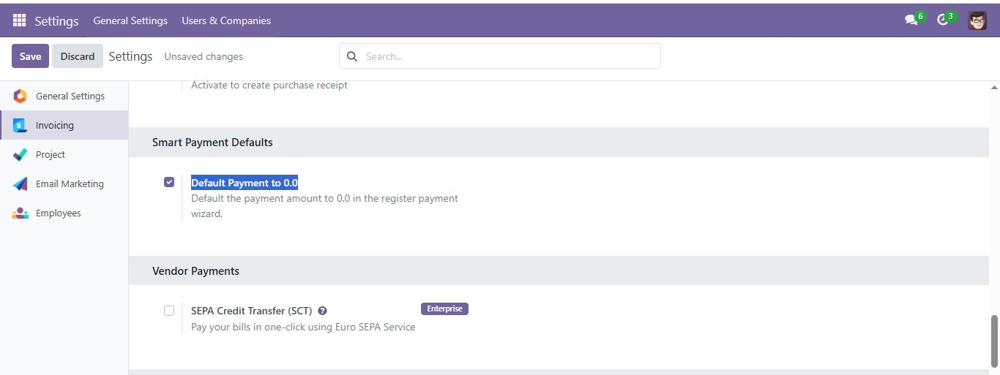
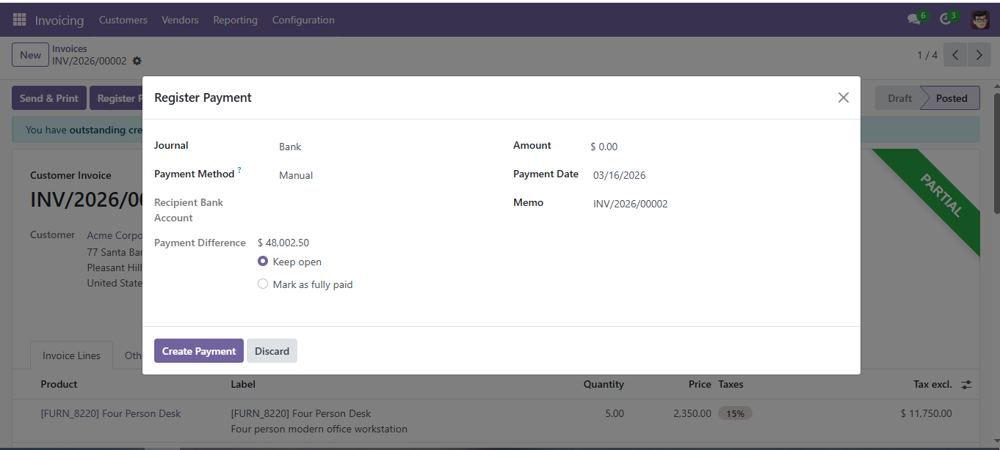
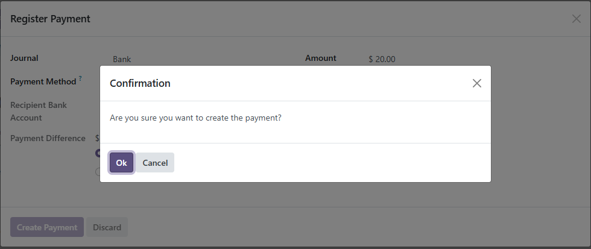

# Smart Payment Defaults

**Stop Accidental Payments. Start Intentional Accounting.**

Standard Odoo behavior automatically populates the payment amount with the full pending balance. While designed for speed, this automation often leads to **accidental full payments** or data entry errors when only a partial payment was intended.

---

## 🛑 The Problem
- **Accidental Submissions**: One-click payments can finalize invoices before the user verifies the actual amount received.
- **Partial Payment Friction**: Users have to delete the auto-filled amount to enter a partial one, increasing the risk of typos.
- **Audit Risk**: Incorrectly closed invoices due to "default-to-full" automation.

## ✅ The Solution
**Smart Payment Defaults** gives control back to the accountant through two simple but powerful safeguards:

### 1. Intentional Entry (Default to 0.0)
The module allows you to force the "Amount" field to start at **0.00**. This ensures the user must manually type the amount, verifying it against the physical check or bank statement in hand.

### 2. Final Confirmation Step
A confirmation dialog appears before the payment is generated. This "speed bump" ensures the user has a final moment to review the Journal, Date, and Amount before the ledger is updated.

---

## 🛠 Features at a Glance
- **Configurable Defaults**: Enable or disable the "Start at 0.0" behavior in Accounting settings.
- **Universal Safety**: Confirmation dialogs are added to both single and batch payment registers.
- **Zero Configuration**: Works out of the box with your existing Accounting setup.

## 📸 Guided Tour

### Step 1: Control Your Workflow
Enable the behavior only when you need it.

### Step 2: Intentional Registering
Notice the amount starts at 0.0, requiring a conscious entry.

### Step 3: The Safety Net
A final confirmation before the ledger is impacted.

---
*Precision tools for serious accounting.*
