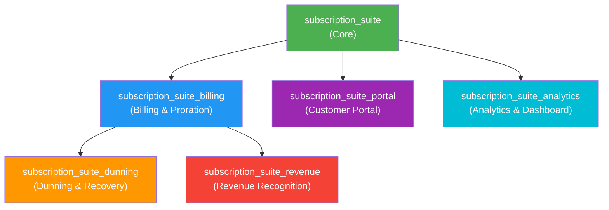
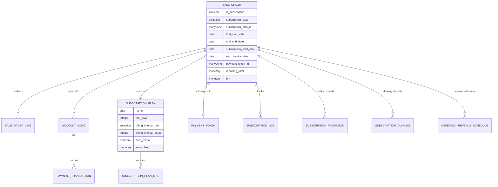
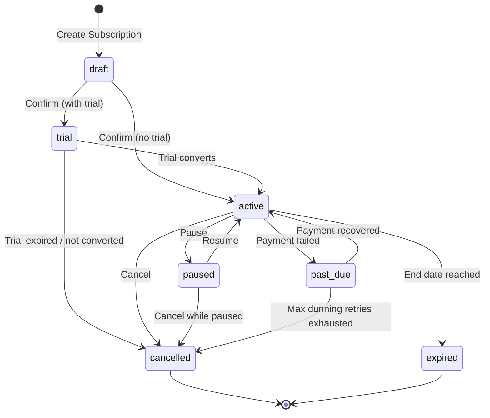

# Subscription Suite — Product Requirements Document (PRD)

**Module Technical Name**: `subscription_suite`  
**Odoo Version Target**: 17.0 (forward-compatible with 18.0)  
**License**: LGPL-3  
**Document Version**: 1.0  
**Last Updated**: 2026-06-02  

---

## Table of Contents

1. [Executive Summary](#1-executive-summary)
2. [Product Vision & Goals](#2-product-vision--goals)
3. [Competitive Landscape Analysis](#3-competitive-landscape-analysis)
4. [System Architecture Overview](#4-system-architecture-overview)
5. [Subscription Lifecycle Flow](#5-subscription-lifecycle-flow)
6. [Phase 1 — Core Subscription Engine](#6-phase-1--core-subscription-engine)
7. [Phase 2 — Advanced Billing & Proration](#7-phase-2--advanced-billing--proration)
8. [Phase 3 — Dunning & Payment Recovery](#8-phase-3--dunning--payment-recovery)
9. [Phase 4 — Customer Portal & Self-Service](#9-phase-4--customer-portal--self-service)
10. [Phase 5 — Analytics & Dashboard](#10-phase-5--analytics--dashboard)
11. [Phase 6 — Revenue Recognition](#11-phase-6--revenue-recognition)
12. [Cross-Cutting Concerns](#12-cross-cutting-concerns)
13. [Non-Functional Requirements](#13-non-functional-requirements)
14. [Glossary](#14-glossary)

---

## 1. Executive Summary

### 1.1 Problem Statement

Odoo Community Edition lacks a comprehensive, production-grade subscription management module. Existing solutions are either:

- **Odoo Enterprise `sale_subscription`**: Locked behind the Enterprise paywall; lacks advanced proration, dunning, and revenue recognition
- **OCA `contract`**: Solid recurring invoicing but no trial management, proration, dunning, pause/resume, analytics, or customer portal
- **Soft Magic `subscription_billing`** ($371 OPL-1): Standalone model (not extending `sale.order`); no proration, no dunning, no revenue recognition, no pause/resume

**Subscription Suite** fills this gap with a full-lifecycle, modular subscription management system built on Odoo best practices.

### 1.2 Solution Overview

A modular suite of 6 Odoo modules that together provide complete subscription lifecycle management:

| Module | Technical Name | Purpose |
|--------|---------------|---------|
| **Core** | `subscription_suite` | Subscription engine, plans, state machine, recurring invoicing |
| **Billing** | `subscription_suite_billing` | Proration, credit notes, payment automation |
| **Dunning** | `subscription_suite_dunning` | Failed payment recovery, retry campaigns |
| **Portal** | `subscription_suite_portal` | Customer self-service portal |
| **Analytics** | `subscription_suite_analytics` | MRR/ARR, churn, cohort analysis, OWL dashboard |
| **Revenue** | `subscription_suite_revenue` | Deferred revenue, ASC 606 / IFRS 15 recognition |

### 1.3 Key Design Decisions

| Decision | Choice | Rationale |
|----------|--------|-----------|
| Core Model Strategy | **Extend `sale.order`** | Leverages existing sales pipeline, pricing, taxes, discounts, and CRM integration. Follows Odoo Enterprise pattern. |
| New Standalone Models | Plans, Dunning, Proration, Revenue Schedules | These concepts don't exist in base Odoo and need dedicated models |
| Billing Engine | **`ir.cron`** with batch processing | Standard Odoo pattern; savepoint-based error isolation per subscription |
| State Machine | **7-state lifecycle** | `draft → trial → active → paused → past_due → cancelled → expired` |
| Modular Architecture | **6 independently installable modules** | Allows phased deployment; each module depends only on what it needs |

---

## 2. Product Vision & Goals

### 2.1 Vision

Deliver the most comprehensive open-source subscription management solution for Odoo, rivaling the capabilities of dedicated platforms like Chargebee, Recurly, and Stripe Billing — while maintaining deep, native Odoo integration.

### 2.2 Goals

| # | Goal | Success Metric |
|---|------|---------------|
| G1 | Full subscription lifecycle management | All 7 states and transitions implemented |
| G2 | Automated recurring billing | Zero-touch invoice generation for active subscriptions |
| G3 | Intelligent dunning | ≥30% payment recovery rate on failed first attempts |
| G4 | Real-time proration | Accurate to-the-day proration on all plan changes |
| G5 | Self-service portal | Customers can manage subscriptions without contacting support |
| G6 | Actionable analytics | MRR, ARR, churn, LTV visible in real-time dashboard |
| G7 | Revenue compliance | ASC 606 / IFRS 15 compliant deferred revenue recognition |
| G8 | Odoo-native experience | Indistinguishable from a first-party Odoo module |

### 2.3 Target Users

| Persona | Role | Needs |
|---------|------|-------|
| **Subscription Manager** | Manages plans, monitors health | Dashboard, bulk actions, alerts |
| **Finance/Accounting** | Invoicing, revenue recognition | Accurate invoices, journal entries, deferred revenue |
| **Customer Support** | Handles customer requests | Quick subscription lookup, manual actions |
| **End Customer** | Subscriber | Portal self-service, transparent billing |
| **System Admin** | Module configuration | Easy setup, clear documentation |

---

## 3. Competitive Landscape Analysis

### 3.1 Feature Comparison Matrix

| Feature | Odoo Enterprise `sale_subscription` | OCA `contract` | Soft Magic `subscription_billing` | **Subscription Suite** (Target) |
|---------|:---:|:---:|:---:|:---:|
| Extends `sale.order` | ✅ | ❌ | ❌ | ✅ |
| Subscription Plans/Templates | ✅ | ✅ | ✅ | ✅ |
| Trial Periods | ✅ | ❌ | ✅ | ✅ |
| Flexible Billing Cycles | ⚠️ Basic | ✅ Per-line | ⚠️ Predefined | ✅ Per-line + custom |
| Pause/Resume | ✅ | ❌ | ❌ | ✅ |
| Proration Engine | ⚠️ Basic | ❌ | ❌ | ✅ Full |
| Dunning/Payment Recovery | ⚠️ Basic | ❌ | ⚠️ Email only | ✅ Multi-step |
| Revenue Recognition | ❌ | ❌ | ❌ | ✅ ASC 606 |
| Customer Portal | ✅ | ❌ | ✅ | ✅ Advanced |
| Analytics Dashboard | ✅ MRR | ❌ | ⚠️ Basic | ✅ Full suite |
| Multi-Currency | ✅ | ✅ | ❌ | ✅ |
| Multi-Company | ✅ | ✅ | ⚠️ | ✅ |
| Usage-Based Billing | ❌ | ⚠️ Formula | ❌ | ✅ Phase 2+ |
| Community Edition | ❌ | ✅ | ✅ | ✅ |
| Price | Enterprise License | Free | $371 | Free (LGPL-3) |

### 3.2 Key Differentiators

1. **Only solution that extends `sale.order` AND is available for Community Edition**
2. **Only solution with a true proration engine**
3. **Only solution with multi-step dunning campaigns**
4. **Only open-source solution with revenue recognition (ASC 606 / IFRS 15)**
5. **Modular architecture** — install only what you need

### 3.3 Lessons from Competitors

| Source | Lesson | Application |
|--------|--------|-------------|
| OCA `contract` | Abstract models enable extensibility | Use abstract `subscription.abstract.mixin` for shared logic |
| OCA `contract` | Per-line recurrence is powerful | Support line-level billing cycle overrides |
| Soft Magic | Standalone model causes data silos | Extend `sale.order` instead |
| Soft Magic | Portal is expected table-stakes | Include portal from Phase 4 |
| Odoo Enterprise | State machine with `subscription_state` | Adopt similar but richer state machine |
| Odoo Enterprise | Integration with payment tokens | Reuse `payment.token` for auto-billing |

---

## 4. System Architecture Overview

### 4.1 Module Dependency Graph



### 4.2 Odoo Base Module Dependencies

```
subscription_suite (Core):
  depends: ['sale_management', 'account', 'payment', 'mail', 'portal']

subscription_suite_billing:
  depends: ['subscription_suite', 'account']

subscription_suite_dunning:
  depends: ['subscription_suite_billing', 'mail']

subscription_suite_portal:
  depends: ['subscription_suite', 'portal', 'website']

subscription_suite_analytics:
  depends: ['subscription_suite']

subscription_suite_revenue:
  depends: ['subscription_suite_billing', 'account']
```

### 4.3 High-Level Data Model



### 4.4 Directory Structure

```
subscription_suite/                          # Phase 1: Core
├── __init__.py
├── __manifest__.py
├── models/
│   ├── __init__.py
│   ├── subscription_plan.py                 # subscription.plan model
│   ├── subscription_plan_line.py            # subscription.plan.line model
│   ├── sale_order.py                        # sale.order extension
│   ├── sale_order_line.py                   # sale.order.line extension
│   ├── product_template.py                  # product.template extension
│   ├── res_partner.py                       # res.partner extension
│   ├── account_move.py                      # account.move extension
│   └── subscription_log.py                  # subscription.log model
├── views/
│   ├── subscription_plan_views.xml
│   ├── sale_order_views.xml
│   ├── product_template_views.xml
│   ├── res_partner_views.xml
│   └── menu_views.xml
├── data/
│   ├── cron_data.xml
│   ├── mail_template_data.xml
│   ├── sequence_data.xml
│   └── subscription_plan_data.xml           # Demo plans
├── security/
│   ├── subscription_security.xml
│   └── ir.model.access.csv
├── report/
│   └── subscription_report.py
├── wizard/
│   ├── __init__.py
│   └── subscription_close_wizard.py
├── static/
│   └── description/
│       ├── icon.png
│       └── index.html
└── tests/
    ├── __init__.py
    ├── test_subscription_plan.py
    ├── test_subscription_lifecycle.py
    └── test_recurring_invoice.py

subscription_suite_billing/                  # Phase 2: Billing
├── __init__.py
├── __manifest__.py
├── models/
│   ├── __init__.py
│   ├── sale_order.py                        # Extends with billing logic
│   ├── subscription_proration.py            # subscription.proration model
│   └── account_move.py                      # Extends with proration lines
├── views/
│   ├── sale_order_views.xml
│   └── subscription_proration_views.xml
├── data/
│   └── cron_data.xml
├── security/
│   └── ir.model.access.csv
├── wizard/
│   ├── __init__.py
│   ├── subscription_change_plan_wizard.py
│   └── subscription_manual_invoice_wizard.py
└── tests/
    ├── __init__.py
    ├── test_proration.py
    └── test_payment_collection.py

subscription_suite_dunning/                  # Phase 3: Dunning
├── __init__.py
├── __manifest__.py
├── models/
│   ├── __init__.py
│   ├── sale_order.py                        # Extends with dunning state
│   ├── subscription_dunning_policy.py       # subscription.dunning.policy
│   ├── subscription_dunning_step.py         # subscription.dunning.step
│   └── subscription_dunning_attempt.py      # subscription.dunning.attempt
├── views/
│   ├── subscription_dunning_views.xml
│   └── sale_order_views.xml
├── data/
│   ├── cron_data.xml
│   ├── mail_template_data.xml
│   └── dunning_policy_data.xml
├── security/
│   └── ir.model.access.csv
└── tests/
    ├── __init__.py
    └── test_dunning.py

subscription_suite_portal/                   # Phase 4: Portal
├── __init__.py
├── __manifest__.py
├── controllers/
│   ├── __init__.py
│   └── portal.py
├── models/
│   ├── __init__.py
│   └── sale_order.py                        # Portal-specific computed fields
├── views/
│   └── portal_templates.xml
├── static/
│   └── src/
│       ├── js/
│       │   └── portal_subscription.js
│       └── scss/
│           └── portal_subscription.scss
├── security/
│   └── ir.model.access.csv
└── tests/
    ├── __init__.py
    └── test_portal.py

subscription_suite_analytics/                # Phase 5: Analytics
├── __init__.py
├── __manifest__.py
├── models/
│   ├── __init__.py
│   ├── sale_order.py                        # Extends with metric fields
│   ├── subscription_mrr_log.py              # subscription.mrr.log
│   └── subscription_report.py               # SQL-based report model
├── views/
│   ├── subscription_dashboard_views.xml
│   └── subscription_report_views.xml
├── static/
│   └── src/
│       ├── js/
│       │   └── subscription_dashboard.js    # OWL dashboard component
│       ├── xml/
│       │   └── subscription_dashboard.xml   # OWL template
│       └── scss/
│           └── subscription_dashboard.scss
├── data/
│   └── cron_data.xml                        # Daily MRR snapshot cron
├── security/
│   └── ir.model.access.csv
└── tests/
    ├── __init__.py
    └── test_analytics.py

subscription_suite_revenue/                  # Phase 6: Revenue Recognition
├── __init__.py
├── __manifest__.py
├── models/
│   ├── __init__.py
│   ├── sale_order.py
│   ├── deferred_revenue_schedule.py         # subscription.deferred.revenue
│   ├── deferred_revenue_line.py             # subscription.deferred.revenue.line
│   └── account_move.py
├── views/
│   ├── deferred_revenue_views.xml
│   └── sale_order_views.xml
├── data/
│   └── cron_data.xml                        # Monthly recognition cron
├── wizard/
│   ├── __init__.py
│   └── revenue_recognition_wizard.py
├── security/
│   └── ir.model.access.csv
└── tests/
    ├── __init__.py
    └── test_revenue_recognition.py
```

---

## 5. Subscription Lifecycle Flow

### 5.1 Complete State Machine



### 5.2 State Definitions

| State | Value | Description | Allowed Actions |
|-------|-------|-------------|-----------------|
| **Draft** | `draft` | Subscription created but not yet confirmed | Edit, Confirm, Delete |
| **Trial** | `trial` | Customer is in a free trial period | Convert, Cancel, Edit plan |
| **Active** | `active` | Subscription is active and billing | Pause, Cancel, Upgrade/Downgrade |
| **Paused** | `paused` | Temporarily suspended; no billing occurs | Resume, Cancel |
| **Past Due** | `past_due` | Payment failed; dunning in progress | Retry Payment, Cancel, (auto-transitions) |
| **Cancelled** | `cancelled` | Subscription terminated by customer or system | Reactivate (creates new subscription) |
| **Expired** | `expired` | Subscription reached its end date naturally | Renew (creates new subscription) |

### 5.3 State Transition Rules

```python
SUBSCRIPTION_STATE_TRANSITIONS = {
    'draft':    ['trial', 'active', 'cancelled'],
    'trial':    ['active', 'cancelled'],
    'active':   ['paused', 'past_due', 'cancelled', 'expired'],
    'paused':   ['active', 'cancelled'],
    'past_due': ['active', 'cancelled'],
    'cancelled': [],  # Terminal state
    'expired':  [],   # Terminal state
}
```

### 5.4 End-to-End Flow Diagram

```
┌─────────────────────────────────────────────────────────────────────┐
│                     SUBSCRIPTION LIFECYCLE                          │
├─────────────────────────────────────────────────────────────────────┤
│                                                                     │
│  ┌──────────┐     ┌──────────┐     ┌──────────────────┐            │
│  │ Customer  │────▶│  Draft   │────▶│ Trial (optional) │            │
│  │  Signup   │     │          │     │  N days free     │            │
│  └──────────┘     └──────────┘     └────────┬─────────┘            │
│                         │                    │                      │
│                         │ (no trial)         │ (converts)           │
│                         ▼                    ▼                      │
│                   ┌──────────────────────────────┐                  │
│              ┌───▶│     SUBSCRIPTION ACTIVE       │◀──────────┐     │
│              │    │  (recurring billing active)   │           │     │
│              │    └──────┬────────┬───────┬───────┘           │     │
│              │           │        │       │                   │     │
│   ┌─────────┤     ┌─────┘   ┌────┘       └────┐             │     │
│   │ Resume  │     │         │                  │             │     │
│   │         │     ▼         ▼                  ▼             │     │
│   │  ┌──────┴──┐ ┌────────────────┐  ┌─────────────┐        │     │
│   │  │ Paused  │ │ Upgrade /      │  │  Recurring   │        │     │
│   │  │ State   │ │ Downgrade      │  │  Billing     │        │     │
│   │  └─────────┘ │                │  │  (cron)      │        │     │
│   │              └───────┬────────┘  └──────┬───────┘        │     │
│   │                      │                  │                │     │
│   │                      ▼                  ▼                │     │
│   │              ┌───────────────┐  ┌───────────────┐        │     │
│   │              │   Proration   │  │    Invoice    │        │     │
│   │              │  Calculation  │  │   Generated   │        │     │
│   │              └───────┬───────┘  └───────┬───────┘        │     │
│   │                      │                  │                │     │
│   │                      ▼                  ▼                │     │
│   │              ┌───────────────┐  ┌───────────────┐        │     │
│   │              │ Credit Note + │  │   Payment     │        │     │
│   │              │ New Invoice   │  │  Collection   │        │     │
│   │              └───────────────┘  └──┬────────┬───┘        │     │
│   │                                    │        │            │     │
│   │                              ┌─────┘        └─────┐      │     │
│   │                              ▼                    ▼      │     │
│   │                       ┌──────────┐         ┌──────────┐  │     │
│   │                       │   PAID   │         │  FAILED  │  │     │
│   │                       └────┬─────┘         └────┬─────┘  │     │
│   │                            │                    │        │     │
│   │                            ▼                    ▼        │     │
│   │                    ┌──────────────┐     ┌────────────┐   │     │
│   │                    │   Revenue    │     │  Dunning   │   │     │
│   │                    │ Recognition  │     │  Process   │   │     │
│   │                    └──────────────┘     └──┬─────┬───┘   │     │
│   │                                            │     │       │     │
│   │                                    ┌───────┘     └────┐  │     │
│   │                                    ▼                  ▼  │     │
│   │                             ┌───────────┐     ┌──────────┤     │
│   │                             │ Retry OK  │────▶│  Max     │     │
│   │                             │ (payment  │     │ Retries  │     │
│   │                             │  success) │     │ Exceeded │     │
│   │                             └───────────┘     └────┬─────┘     │
│   │                                                    │           │
│   │                                                    ▼           │
│   │                                            ┌──────────────┐    │
│   │                                            │ Auto-Cancel  │    │
│   │                                            │     END      │    │
│   │                                            └──────────────┘    │
│   │                                                                │
│   └────────────────────────────────────────────────────────────┘    │
│                                                                     │
└─────────────────────────────────────────────────────────────────────┘
```

---

## 6. Phase 1 — Core Subscription Engine

> **Module**: `subscription_suite`  
> **Dependencies**: `sale_management`, `account`, `payment`, `mail`, `portal`  
> **Priority**: 🔴 Critical — Foundation for all other phases

### 6.1 Models

---

#### 6.1.1 `subscription.plan` — Subscription Plan

The template that defines subscription terms. Customers subscribe to plans.

```python
class SubscriptionPlan(models.Model):
    _name = 'subscription.plan'
    _description = 'Subscription Plan'
    _inherit = ['mail.thread', 'mail.activity.mixin']
    _order = 'sequence, id'
```

**Fields:**

| Field | Type | Required | Description |
|-------|------|----------|-------------|
| `name` | `Char` | ✅ | Plan display name (e.g., "Professional Monthly") |
| `code` | `Char` | ✅ | Unique plan code (e.g., "PRO-M") |
| `sequence` | `Integer` | | Ordering sequence |
| `active` | `Boolean` | | Archive toggle (default: `True`) |
| `description` | `Html` | | Rich-text plan description |
| `plan_line_ids` | `One2many → subscription.plan.line` | | Products/services in this plan |
| `billing_interval_count` | `Integer` | ✅ | Number of billing interval units (e.g., `1`) |
| `billing_interval_unit` | `Selection` | ✅ | `[('day','Days'), ('week','Weeks'), ('month','Months'), ('year','Years')]` |
| `trial_days` | `Integer` | | Trial period in days (0 = no trial) |
| `auto_renew` | `Boolean` | | Auto-renew at period end (default: `True`) |
| `setup_fee` | `Monetary` | | One-time setup fee |
| `currency_id` | `Many2one → res.currency` | | Plan currency |
| `company_id` | `Many2one → res.company` | | Company |
| `tag_ids` | `Many2many → subscription.plan.tag` | | Classification tags |
| `subscriber_count` | `Integer` | compute | Count of active subscribers |
| `total_mrr` | `Monetary` | compute | Total MRR across all subscribers |
| `upgrade_plan_ids` | `Many2many → subscription.plan` | | Plans this can upgrade to |
| `downgrade_plan_ids` | `Many2many → subscription.plan` | | Plans this can downgrade to |
| `cancellation_policy` | `Selection` | | `[('immediate','Immediate'), ('end_of_period','End of Billing Period')]` |
| `pause_allowed` | `Boolean` | | Whether pausing is allowed (default: `True`) |
| `max_pause_days` | `Integer` | | Max days a subscription can be paused (0 = unlimited) |
| `min_commitment_periods` | `Integer` | | Minimum commitment in billing periods (0 = none) |

**Constraints:**

```python
_sql_constraints = [
    ('code_unique', 'UNIQUE(code, company_id)', 'Plan code must be unique per company.'),
    ('billing_interval_positive', 'CHECK(billing_interval_count > 0)', 'Billing interval must be positive.'),
    ('trial_days_non_negative', 'CHECK(trial_days >= 0)', 'Trial days cannot be negative.'),
]
```

**Key Methods:**

```python
def action_view_subscribers(self):
    """Open list of active subscribers for this plan."""

def _compute_subscriber_count(self):
    """Count active subscriptions using this plan."""

def _compute_total_mrr(self):
    """Sum MRR of all active subscriptions on this plan."""

def get_next_invoice_date(self, start_date):
    """Calculate next invoice date from start_date based on billing interval."""
    # Uses dateutil.relativedelta for accurate date math
```

---

#### 6.1.2 `subscription.plan.line` — Plan Line Item

Products/services included in a subscription plan.

```python
class SubscriptionPlanLine(models.Model):
    _name = 'subscription.plan.line'
    _description = 'Subscription Plan Line'
    _order = 'sequence, id'
```

**Fields:**

| Field | Type | Required | Description |
|-------|------|----------|-------------|
| `plan_id` | `Many2one → subscription.plan` | ✅ | Parent plan |
| `sequence` | `Integer` | | Ordering |
| `product_id` | `Many2one → product.product` | ✅ | Product (must be `type='service'`) |
| `quantity` | `Float` | ✅ | Default quantity |
| `uom_id` | `Many2one → uom.uom` | | Unit of measure |
| `price_unit` | `Monetary` | | Override price (empty = use product price) |
| `discount` | `Float` | | Default discount % |
| `description` | `Text` | | Override description |

---

#### 6.1.3 `sale.order` — Extended with Subscription Fields

```python
class SaleOrder(models.Model):
    _inherit = 'sale.order'
```

**New Fields:**

| Field | Type | Required | Description |
|-------|------|----------|-------------|
| `is_subscription` | `Boolean` | | Flags this SO as a subscription |
| `subscription_state` | `Selection` | | `draft/trial/active/paused/past_due/cancelled/expired` |
| `subscription_plan_id` | `Many2one → subscription.plan` | | Selected plan |
| `subscription_code` | `Char` | | Unique subscription reference (e.g., "SUB-00042") |
| `trial_start_date` | `Date` | | Trial start |
| `trial_end_date` | `Date` | | Trial end (computed from plan.trial_days) |
| `subscription_start_date` | `Date` | | Paid subscription start |
| `subscription_end_date` | `Date` | | Subscription end (if not auto-renew) |
| `next_invoice_date` | `Date` | | Next billing date |
| `last_invoice_date` | `Date` | | Last successful billing date |
| `billing_interval_count` | `Integer` | | Inherited from plan, can be overridden |
| `billing_interval_unit` | `Selection` | | Inherited from plan, can be overridden |
| `payment_token_id` | `Many2one → payment.token` | | Saved payment method for auto-billing |
| `recurring_total` | `Monetary` | compute | Total recurring amount per period |
| `mrr` | `Monetary` | compute, store | Monthly Recurring Revenue (normalized) |
| `pause_date` | `Date` | | Date subscription was paused |
| `resume_date` | `Date` | | Date subscription was resumed |
| `cancellation_date` | `Date` | | Date subscription was cancelled |
| `cancellation_reason_id` | `Many2one → subscription.cancel.reason` | | Reason for cancellation |
| `cancellation_feedback` | `Text` | | Free-text cancellation feedback |
| `subscription_log_ids` | `One2many → subscription.log` | | Audit log of all lifecycle events |
| `health_score` | `Selection` | compute | `good/at_risk/churning` based on payment history |
| `is_auto_pay` | `Boolean` | compute | Whether auto-payment is configured |
| `days_since_start` | `Integer` | compute | Days since subscription started |
| `current_period_start` | `Date` | compute | Start of current billing period |
| `current_period_end` | `Date` | compute | End of current billing period |

**Key Methods:**

```python
# === State Transitions ===

def action_confirm_subscription(self):
    """Confirm subscription: draft → trial or active.
    
    If plan has trial_days > 0:
        - Set state to 'trial'
        - Set trial_start_date = today
        - Set trial_end_date = today + trial_days
        - Schedule trial expiry check
    Else:
        - Set state to 'active'
        - Set subscription_start_date = today
        - Set next_invoice_date = today (generate first invoice immediately)
        - Generate first invoice
    
    Creates subscription_code via ir.sequence.
    Sends confirmation email.
    Logs event to subscription.log.
    """

def action_trial_convert(self):
    """Convert trial to paid subscription: trial → active.
    
    - Set state to 'active'
    - Set subscription_start_date = today
    - Set next_invoice_date = today
    - Clear trial dates if needed
    - Generate first invoice
    - Send conversion email
    """

def action_pause_subscription(self):
    """Pause subscription: active → paused.
    
    Validates:
        - Plan allows pausing
        - No unpaid invoices
        - Min commitment met
    
    - Set state to 'paused'
    - Set pause_date = today
    - Log event
    - Send pause confirmation email
    """

def action_resume_subscription(self):
    """Resume subscription: paused → active.
    
    - Set state to 'active'
    - Set resume_date = today
    - Recalculate next_invoice_date (skip paused period)
    - Log event
    - Send resume confirmation email
    """

def action_cancel_subscription(self):
    """Open cancellation wizard for user to provide reason.
    
    Returns ir.actions.act_window for subscription.close.wizard.
    """

def _action_cancel(self, reason_id=None, feedback=None):
    """Execute cancellation: active/paused/past_due/trial → cancelled.
    
    Based on plan.cancellation_policy:
        - 'immediate': Cancel now, generate final prorated credit if applicable
        - 'end_of_period': Set end_date to current_period_end, cancel at period end
    
    - Set state to 'cancelled'
    - Set cancellation_date = today
    - Store reason and feedback
    - Send cancellation email
    - Log event
    """

def action_expire_subscription(self):
    """Expire subscription when end_date is reached: active → expired.
    
    - Set state to 'expired'
    - Send expiration email
    - Log event
    """

# === Recurring Billing ===

@api.model
def _cron_generate_subscription_invoices(self):
    """Main cron job: generate invoices for all due subscriptions.
    
    1. Search for active subscriptions where next_invoice_date <= today
    2. Process in batches of 50
    3. For each subscription:
        a. Use cr.savepoint() for error isolation
        b. Call _generate_subscription_invoice()
        c. Log success/failure
    4. Commit after each batch
    """

def _generate_subscription_invoice(self):
    """Generate a single invoice for this subscription.
    
    1. Validate subscription is in billable state
    2. Prepare invoice values from subscription lines
    3. Create account.move (draft invoice)
    4. Post invoice (action_post)
    5. Advance next_invoice_date by billing interval
    6. If payment_token_id exists, attempt auto-collection
    7. Log event
    8. Return created invoice
    """

def _prepare_subscription_invoice_values(self):
    """Prepare account.move values dict from subscription data."""

@api.model
def _cron_check_trial_expiry(self):
    """Cron job: check for expired trials.
    
    Find subscriptions where:
        - state = 'trial'
        - trial_end_date < today
    
    For each: transition to 'cancelled' (trial expired, not converted)
    """

@api.model
def _cron_check_subscription_expiry(self):
    """Cron job: check for subscriptions past their end date.
    
    Find subscriptions where:
        - state = 'active'
        - subscription_end_date is set
        - subscription_end_date <= today
    
    For each: call action_expire_subscription()
    """

# === Computed Fields ===

@api.depends('order_line.price_subtotal')
def _compute_recurring_total(self):
    """Sum of all recurring line subtotals."""

@api.depends('recurring_total', 'billing_interval_count', 'billing_interval_unit')
def _compute_mrr(self):
    """Normalize recurring_total to monthly value.
    
    Conversion rules:
        - daily: amount * 30
        - weekly: amount * (30/7)
        - monthly: amount * (1/count)
        - yearly: amount / 12
    """

# === Helpers ===

def _get_next_invoice_date(self):
    """Calculate the next invoice date based on billing interval."""

def _log_subscription_event(self, event_type, description, old_values=None, new_values=None):
    """Create a subscription.log entry for audit trail."""

def _send_subscription_email(self, template_xmlid):
    """Send email using the specified mail template."""
```

---

#### 6.1.4 `sale.order.line` — Extended for Subscriptions

```python
class SaleOrderLine(models.Model):
    _inherit = 'sale.order.line'
```

**New Fields:**

| Field | Type | Description |
|-------|------|-------------|
| `is_recurring` | `Boolean` | Whether this line recurs each billing cycle |
| `recurring_interval_count` | `Integer` | Line-level override (optional) |
| `recurring_interval_unit` | `Selection` | Line-level override (optional) |
| `recurring_next_date` | `Date` | Line-level next invoice date (if different from subscription) |

---

#### 6.1.5 `subscription.log` — Subscription Event Log

Immutable audit trail of all subscription lifecycle events.

```python
class SubscriptionLog(models.Model):
    _name = 'subscription.log'
    _description = 'Subscription Event Log'
    _order = 'create_date desc'
    _rec_name = 'event_type'
```

**Fields:**

| Field | Type | Required | Description |
|-------|------|----------|-------------|
| `subscription_id` | `Many2one → sale.order` | ✅ | Related subscription |
| `event_type` | `Selection` | ✅ | See event types below |
| `event_date` | `Datetime` | ✅ | When the event occurred |
| `description` | `Text` | | Human-readable description |
| `old_value` | `Char` | | Previous state/value (JSON serialized) |
| `new_value` | `Char` | | New state/value (JSON serialized) |
| `user_id` | `Many2one → res.users` | | User who triggered the event |
| `invoice_id` | `Many2one → account.move` | | Related invoice if applicable |
| `amount` | `Monetary` | | Related monetary amount if applicable |

**Event Types:**

```python
EVENT_TYPES = [
    ('created', 'Created'),
    ('confirmed', 'Confirmed'),
    ('trial_started', 'Trial Started'),
    ('trial_converted', 'Trial Converted'),
    ('trial_expired', 'Trial Expired'),
    ('activated', 'Activated'),
    ('paused', 'Paused'),
    ('resumed', 'Resumed'),
    ('plan_changed', 'Plan Changed'),
    ('upgraded', 'Upgraded'),
    ('downgraded', 'Downgraded'),
    ('invoice_generated', 'Invoice Generated'),
    ('payment_success', 'Payment Successful'),
    ('payment_failed', 'Payment Failed'),
    ('dunning_started', 'Dunning Started'),
    ('dunning_success', 'Dunning Recovery'),
    ('cancelled', 'Cancelled'),
    ('expired', 'Expired'),
    ('renewed', 'Renewed'),
]
```

---

#### 6.1.6 `subscription.cancel.reason` — Cancellation Reasons

```python
class SubscriptionCancelReason(models.Model):
    _name = 'subscription.cancel.reason'
    _description = 'Subscription Cancellation Reason'
    _order = 'sequence, id'
```

**Fields:**

| Field | Type | Required | Description |
|-------|------|----------|-------------|
| `name` | `Char` | ✅ | Reason (e.g., "Too expensive", "Switched to competitor") |
| `sequence` | `Integer` | | Ordering |
| `active` | `Boolean` | | Archive toggle |

---

#### 6.1.7 `product.template` — Extension

```python
class ProductTemplate(models.Model):
    _inherit = 'product.template'
```

**New Fields:**

| Field | Type | Description |
|-------|------|-------------|
| `is_subscription_product` | `Boolean` | Flags product as subscription-compatible |
| `subscription_plan_ids` | `Many2many → subscription.plan` | Plans that include this product |

---

#### 6.1.8 `res.partner` — Extension

```python
class ResPartner(models.Model):
    _inherit = 'res.partner'
```

**New Fields:**

| Field | Type | Description |
|-------|------|-------------|
| `subscription_count` | `Integer` | compute: count of subscriptions |
| `active_subscription_count` | `Integer` | compute: count of active subscriptions |
| `total_mrr` | `Monetary` | compute: sum of MRR across subscriptions |
| `subscription_ids` | `One2many → sale.order` | All subscriptions for this customer |
| `is_subscriber` | `Boolean` | compute: has any active subscription |

---

#### 6.1.9 `account.move` — Extension

```python
class AccountMove(models.Model):
    _inherit = 'account.move'
```

**New Fields:**

| Field | Type | Description |
|-------|------|-------------|
| `subscription_id` | `Many2one → sale.order` | Linked subscription |
| `is_subscription_invoice` | `Boolean` | compute: derived from subscription_id |
| `subscription_period_start` | `Date` | Billing period start |
| `subscription_period_end` | `Date` | Billing period end |

---

### 6.2 Views

#### 6.2.1 Subscription Plan Views

- **Tree View**: Name, Code, Billing Interval display, Trial Days, Active Subscribers, Total MRR
- **Form View**: 
  - Header: status indicator
  - Sheet with notebook:
    - **Plan Details** tab: Name, Code, Billing interval, Trial, Auto-renew, Setup fee, Cancellation policy, Pause settings, Min commitment
    - **Products** tab: Inline tree of `plan_line_ids` (product, qty, price, discount)
    - **Upgrade/Downgrade Paths** tab: Many2many widgets for upgrade/downgrade plans
    - **Subscribers** tab: Related subscriptions (smart button preferred)
  - Chatter below
- **Kanban View**: Card with plan name, price summary, subscriber count, MRR badge

#### 6.2.2 Subscription Views (sale.order extended)

- **Tree View** (filtered `is_subscription=True`): Subscription Code, Customer, Plan, State (badge), MRR, Next Invoice Date, Health Score
- **Form View** (extend existing sale.order form):
  - Conditional visibility: show subscription fields only when `is_subscription=True`
  - Header buttons: Confirm, Pause, Resume, Cancel (state-dependent visibility)
  - Subscription info section above order lines: Plan, State, Trial dates, Billing interval, Next invoice date, Payment token
  - Stat buttons: Invoice Count, Payment history, MRR
  - Notebook tab: **Subscription Log** showing `subscription_log_ids` inline tree
- **Kanban View**: Grouped by `subscription_state`, showing customer, plan, MRR, next invoice date
- **Calendar View**: Showing subscriptions on their next invoice dates
- **Graph/Pivot Views**: MRR by plan, by state, by month

#### 6.2.3 Menu Structure

```
Subscriptions (top-level menu)
├── Dashboard (Phase 5: OWL dashboard action)
├── Subscriptions
│   ├── All Subscriptions (tree/kanban/form)
│   ├── To Invoice (filtered: next_invoice_date <= today)
│   └── Trials Expiring Soon (filtered: trial, trial_end_date <= today + 7)
├── Plans
│   └── Subscription Plans (tree/kanban/form)
├── Configuration
│   ├── Cancellation Reasons
│   ├── Plan Tags
│   └── Settings
└── Reporting (Phase 5)
    ├── MRR Analysis
    └── Subscription Analysis
```

### 6.3 Cron Jobs

| Cron ID | Schedule | Method | Description |
|---------|----------|--------|-------------|
| `cron_generate_subscription_invoices` | Daily, 6:00 AM | `sale.order._cron_generate_subscription_invoices()` | Generate invoices for due subscriptions |
| `cron_check_trial_expiry` | Daily, 7:00 AM | `sale.order._cron_check_trial_expiry()` | Cancel expired trials |
| `cron_check_subscription_expiry` | Daily, 7:00 AM | `sale.order._cron_check_subscription_expiry()` | Expire ended subscriptions |

### 6.4 Email Templates

| Template XML ID | Trigger | Recipient |
|-----------------|---------|-----------|
| `mail_template_subscription_confirmed` | Subscription confirmed | Customer |
| `mail_template_trial_started` | Trial begins | Customer |
| `mail_template_trial_expiring` | Trial ending in 3 days | Customer |
| `mail_template_trial_expired` | Trial expired without conversion | Customer |
| `mail_template_subscription_paused` | Subscription paused | Customer |
| `mail_template_subscription_resumed` | Subscription resumed | Customer |
| `mail_template_subscription_cancelled` | Subscription cancelled | Customer |
| `mail_template_subscription_expired` | Subscription naturally expired | Customer |
| `mail_template_invoice_generated` | New subscription invoice created | Customer |
| `mail_template_upcoming_renewal` | Renewal in 7 days | Customer |

### 6.5 Security

**Groups:**

| Group XML ID | Name | Implied Group | Permissions |
|-------------|------|---------------|-------------|
| `group_subscription_user` | Subscription User | `sales_team.group_sale_salesman` | Read subscriptions, plans |
| `group_subscription_manager` | Subscription Manager | `group_subscription_user` | Full CRUD on all subscription models |

**Access Rules (`ir.model.access.csv`):**

| Model | User | Manager |
|-------|------|---------|
| `subscription.plan` | Read | Full |
| `subscription.plan.line` | Read | Full |
| `subscription.log` | Read | Read, Create |
| `subscription.cancel.reason` | Read | Full |

**Record Rules:**

- `subscription_personal_rule`: Users see only subscriptions where `user_id = current_user` or `user_id = False`
- `subscription_manager_rule`: Managers see all subscriptions
- `subscription_multi_company_rule`: Standard multi-company domain

### 6.6 Sequences

```xml
<record id="sequence_subscription_code" model="ir.sequence">
    <field name="name">Subscription Code</field>
    <field name="code">subscription.code</field>
    <field name="prefix">SUB-</field>
    <field name="padding">5</field>
    <field name="number_next">1</field>
    <field name="number_increment">1</field>
</record>
```

### 6.7 Wizard: Subscription Close

```python
class SubscriptionCloseWizard(models.TransientModel):
    _name = 'subscription.close.wizard'
    _description = 'Close/Cancel Subscription Wizard'
```

**Fields:**

| Field | Type | Description |
|-------|------|-------------|
| `subscription_id` | `Many2one → sale.order` | Subscription to close |
| `cancel_reason_id` | `Many2one → subscription.cancel.reason` | Selected reason |
| `feedback` | `Text` | Optional free-text feedback |
| `cancel_date` | `Date` | Effective cancellation date (default: today or end of period) |
| `cancellation_policy` | `Selection` | Read-only, from plan |

**Methods:**

```python
def action_cancel(self):
    """Execute the cancellation with selected reason and feedback."""
```

### 6.8 Phase 1 Acceptance Criteria

- [ ] Can create subscription plans with configurable billing intervals and trial periods
- [ ] Can create a subscription (sale.order with is_subscription=True) linked to a plan
- [ ] Subscription follows the state machine: draft → trial → active → paused → cancelled/expired
- [ ] Cron generates invoices for active subscriptions on their next_invoice_date
- [ ] next_invoice_date advances correctly after each invoice generation
- [ ] Trial expiry cron auto-cancels unconverted trials
- [ ] Pause/Resume works with correct next_invoice_date recalculation
- [ ] Cancellation wizard captures reason and feedback
- [ ] Subscription code is auto-generated via ir.sequence
- [ ] All email templates send correctly on state transitions
- [ ] Subscription log captures all lifecycle events
- [ ] MRR computed field normalizes to monthly correctly for all interval types
- [ ] Multi-company record rules work correctly
- [ ] Menu structure and views are functional
- [ ] All security groups and access rules are in place
- [ ] Partner subscription count/MRR computed fields work

---

## 7. Phase 2 — Advanced Billing & Proration

> **Module**: `subscription_suite_billing`  
> **Dependencies**: `subscription_suite`, `account`  
> **Priority**: 🟠 High — Required for plan changes and auto-payment

### 7.1 Models

---

#### 7.1.1 `subscription.proration` — Proration Record

Records every proration calculation for audit and accounting.

```python
class SubscriptionProration(models.Model):
    _name = 'subscription.proration'
    _description = 'Subscription Proration Record'
    _order = 'create_date desc'
```

**Fields:**

| Field | Type | Required | Description |
|-------|------|----------|-------------|
| `subscription_id` | `Many2one → sale.order` | ✅ | Related subscription |
| `change_type` | `Selection` | ✅ | `[('upgrade','Upgrade'), ('downgrade','Downgrade'), ('cancel','Cancellation')]` |
| `change_date` | `Date` | ✅ | Date of the plan change |
| `old_plan_id` | `Many2one → subscription.plan` | ✅ | Previous plan |
| `new_plan_id` | `Many2one → subscription.plan` | | New plan (null if cancellation) |
| `period_start` | `Date` | ✅ | Current billing period start |
| `period_end` | `Date` | ✅ | Current billing period end |
| `total_period_days` | `Integer` | compute | Total days in the billing period |
| `used_days` | `Integer` | compute | Days used on old plan |
| `remaining_days` | `Integer` | compute | Days remaining in period |
| `old_daily_rate` | `Monetary` | ✅ | Old plan price ÷ period days |
| `new_daily_rate` | `Monetary` | | New plan price ÷ period days |
| `credit_amount` | `Monetary` | compute | Unused portion to credit (remaining_days × old_daily_rate) |
| `charge_amount` | `Monetary` | compute | Remaining portion to charge (remaining_days × new_daily_rate) |
| `net_amount` | `Monetary` | compute | charge_amount - credit_amount |
| `credit_note_id` | `Many2one → account.move` | | Generated credit note |
| `adjustment_invoice_id` | `Many2one → account.move` | | Generated proration invoice |
| `state` | `Selection` | | `[('draft','Draft'), ('applied','Applied'), ('cancelled','Cancelled')]` |

**Key Methods:**

```python
def _compute_proration(self):
    """Calculate proration amounts.
    
    Formula:
        total_period_days = (period_end - period_start).days
        used_days = (change_date - period_start).days
        remaining_days = total_period_days - used_days
        old_daily_rate = old_plan_recurring_total / total_period_days
        new_daily_rate = new_plan_recurring_total / total_period_days
        credit_amount = remaining_days * old_daily_rate
        charge_amount = remaining_days * new_daily_rate
        net_amount = charge_amount - credit_amount
    """

def action_apply_proration(self):
    """Apply the proration.
    
    If credit_amount > 0:
        Create credit note for unused old plan portion
    If net_amount > 0 (upgrade):
        Create invoice for the difference
    If net_amount < 0 (downgrade):
        Create credit note for the excess
    If net_amount == 0:
        No financial adjustment needed
    
    Update subscription to new plan.
    """
```

---

#### 7.1.2 `sale.order` — Extended for Billing

```python
class SaleOrder(models.Model):
    _inherit = 'sale.order'
```

**New Methods:**

```python
def action_change_plan(self):
    """Open plan change wizard.
    
    Returns ir.actions.act_window for subscription.change.plan.wizard
    """

def _execute_plan_change(self, new_plan, effective_date=None):
    """Execute a plan change with proration.
    
    1. Create subscription.proration record
    2. Calculate proration amounts
    3. Generate credit note for unused portion
    4. Generate adjustment invoice if upgrade
    5. Update subscription lines to new plan products
    6. Update plan reference
    7. Recalculate next_invoice_date if needed
    8. Log event (upgrade or downgrade)
    """

def _auto_collect_payment(self, invoice):
    """Attempt automatic payment using saved payment token.
    
    1. Validate payment_token_id exists and is active
    2. Create payment.transaction linked to invoice
    3. Call tx._send_payment_request()
    4. Handle response:
        - Success: Mark invoice as paid, log event
        - Failure: Log failure, trigger dunning (Phase 3)
    5. Return transaction
    """

def _generate_setup_fee_invoice(self):
    """Generate one-time setup fee invoice when subscription activates.
    
    Only if plan.setup_fee > 0.
    Creates separate invoice with setup fee product.
    """

@api.model
def _cron_auto_collect_payments(self):
    """Cron: attempt auto-payment for posted subscription invoices.
    
    Find posted, unpaid subscription invoices where:
        - subscription has payment_token_id
        - invoice age < dunning threshold
    
    Attempt collection for each.
    """
```

---

#### 7.1.3 Wizard: Change Plan

```python
class SubscriptionChangePlanWizard(models.TransientModel):
    _name = 'subscription.change.plan.wizard'
    _description = 'Change Subscription Plan'
```

**Fields:**

| Field | Type | Description |
|-------|------|-------------|
| `subscription_id` | `Many2one → sale.order` | Current subscription |
| `current_plan_id` | `Many2one → subscription.plan` | Current plan (read-only) |
| `new_plan_id` | `Many2one → subscription.plan` | Plan to change to |
| `change_type` | `Selection` | compute: 'upgrade' or 'downgrade' based on price comparison |
| `effective_date` | `Date` | When the change takes effect (default: today) |
| `proration_preview` | `Html` | compute: Preview of proration calculation |
| `credit_amount` | `Monetary` | compute: Amount to credit |
| `charge_amount` | `Monetary` | compute: Amount to charge |
| `net_amount` | `Monetary` | compute: Net amount (charge - credit) |
| `available_plan_ids` | `Many2many → subscription.plan` | compute: Plans available for change |

**Methods:**

```python
@api.depends('new_plan_id', 'effective_date')
def _compute_proration_preview(self):
    """Show a preview of the proration calculation before confirming."""

def action_confirm_change(self):
    """Execute the plan change."""
```

### 7.2 Cron Jobs

| Cron ID | Schedule | Method | Description |
|---------|----------|--------|-------------|
| `cron_auto_collect_payments` | Daily, 8:00 AM | `sale.order._cron_auto_collect_payments()` | Auto-collect payments for unpaid subscription invoices |

### 7.3 Phase 2 Acceptance Criteria

- [ ] Proration calculates correctly for upgrades (daily rate × remaining days)
- [ ] Proration calculates correctly for downgrades (credit note generated)
- [ ] Change plan wizard shows accurate proration preview before confirmation
- [ ] Credit notes are generated correctly for the unused portion of old plan
- [ ] Adjustment invoices are generated for the remaining portion on new plan
- [ ] Subscription lines update to reflect new plan products after plan change
- [ ] Setup fee invoice generates on first activation if plan has setup_fee > 0
- [ ] Auto-payment collection works with saved payment tokens
- [ ] Payment success/failure is logged correctly
- [ ] Proration records maintain full audit trail
- [ ] Edge case: plan change on the same day as billing (no proration needed)
- [ ] Edge case: plan change on the last day of period (1-day proration)

---

## 8. Phase 3 — Dunning & Payment Recovery

> **Module**: `subscription_suite_dunning`  
> **Dependencies**: `subscription_suite_billing`, `mail`  
> **Priority**: 🟡 High — Critical for revenue protection

### 8.1 Models

---

#### 8.1.1 `subscription.dunning.policy` — Dunning Policy

Configurable dunning campaign defining retry strategy.

```python
class SubscriptionDunningPolicy(models.Model):
    _name = 'subscription.dunning.policy'
    _description = 'Dunning Policy'
    _order = 'sequence, id'
```

**Fields:**

| Field | Type | Required | Description |
|-------|------|----------|-------------|
| `name` | `Char` | ✅ | Policy name (e.g., "Standard Dunning") |
| `sequence` | `Integer` | | Ordering |
| `active` | `Boolean` | | Archive toggle |
| `description` | `Text` | | Policy description |
| `step_ids` | `One2many → subscription.dunning.step` | ✅ | Dunning steps |
| `grace_period_days` | `Integer` | ✅ | Days before first dunning step (default: 1) |
| `auto_cancel_on_exhaust` | `Boolean` | | Auto-cancel when all steps exhausted (default: True) |
| `company_id` | `Many2one → res.company` | | Company |

---

#### 8.1.2 `subscription.dunning.step` — Dunning Step

Individual step in a dunning campaign.

```python
class SubscriptionDunningStep(models.Model):
    _name = 'subscription.dunning.step'
    _description = 'Dunning Step'
    _order = 'sequence, id'
```

**Fields:**

| Field | Type | Required | Description |
|-------|------|----------|-------------|
| `policy_id` | `Many2one → subscription.dunning.policy` | ✅ | Parent policy |
| `sequence` | `Integer` | ✅ | Step order (1, 2, 3, ...) |
| `name` | `Char` | ✅ | Step name (e.g., "First Retry") |
| `days_after_failure` | `Integer` | ✅ | Days after initial failure to execute this step |
| `action_type` | `Selection` | ✅ | `[('retry_payment','Retry Payment'), ('send_email','Send Email'), ('retry_and_email','Retry + Email'), ('manual','Manual Action Required')]` |
| `email_template_id` | `Many2one → mail.template` | | Email template to send |
| `retry_payment` | `Boolean` | compute | Whether this step retries payment |
| `send_notification` | `Boolean` | compute | Whether this step sends email |

---

#### 8.1.3 `subscription.dunning.attempt` — Dunning Attempt

Records each dunning attempt for a subscription.

```python
class SubscriptionDunningAttempt(models.Model):
    _name = 'subscription.dunning.attempt'
    _description = 'Dunning Attempt'
    _order = 'attempt_date desc'
```

**Fields:**

| Field | Type | Required | Description |
|-------|------|----------|-------------|
| `subscription_id` | `Many2one → sale.order` | ✅ | Related subscription |
| `invoice_id` | `Many2one → account.move` | ✅ | Related unpaid invoice |
| `policy_id` | `Many2one → subscription.dunning.policy` | ✅ | Applied policy |
| `step_id` | `Many2one → subscription.dunning.step` | ✅ | Current step |
| `attempt_number` | `Integer` | ✅ | Which attempt (1, 2, 3...) |
| `attempt_date` | `Datetime` | ✅ | When this attempt occurred |
| `next_attempt_date` | `Date` | | Scheduled next attempt |
| `action_taken` | `Selection` | | `[('retry','Payment Retry'), ('email','Email Sent'), ('retry_and_email','Retry + Email'), ('manual','Manual')]` |
| `result` | `Selection` | | `[('success','Payment Recovered'), ('failed','Retry Failed'), ('pending','Pending'), ('skipped','Skipped')]` |
| `transaction_id` | `Many2one → payment.transaction` | | Related payment transaction if retry |
| `notes` | `Text` | | Additional notes |
| `is_final_attempt` | `Boolean` | compute | Whether this is the last step in the policy |

---

#### 8.1.4 `sale.order` — Extended for Dunning

```python
class SaleOrder(models.Model):
    _inherit = 'sale.order'
```

**New Fields:**

| Field | Type | Description |
|-------|------|-------------|
| `dunning_policy_id` | `Many2one → subscription.dunning.policy` | Applied dunning policy |
| `dunning_attempt_ids` | `One2many → subscription.dunning.attempt` | Dunning attempts |
| `current_dunning_step` | `Integer` | Current step in dunning sequence |
| `dunning_start_date` | `Date` | When dunning started for current invoice |
| `is_in_dunning` | `Boolean` | compute: `subscription_state == 'past_due'` |
| `dunning_attempts_count` | `Integer` | compute: count of attempts |

**Key Methods:**

```python
def _start_dunning(self, invoice):
    """Initiate dunning process for a failed payment.
    
    1. Transition state to 'past_due'
    2. Set dunning_start_date
    3. Load dunning_policy_id (from plan or company default)
    4. Schedule first dunning step after grace_period_days
    5. Log event
    6. Send 'payment failed' notification
    """

def _execute_dunning_step(self, step):
    """Execute a single dunning step.
    
    Based on step.action_type:
        - 'retry_payment': Attempt payment collection, create attempt record
        - 'send_email': Send email template, create attempt record
        - 'retry_and_email': Both
        - 'manual': Create activity for subscription manager
    
    If retry succeeds:
        - Transition to 'active'
        - Clear dunning state
        - Log recovery event
    If retry fails:
        - Advance to next step
        - If no more steps and auto_cancel: call _action_cancel()
    """

@api.model
def _cron_process_dunning(self):
    """Cron: process all pending dunning steps.
    
    Find subscriptions where:
        - state = 'past_due'
        - has pending dunning step where next_attempt_date <= today
    
    Execute the appropriate step for each.
    """

def _recover_from_dunning(self):
    """Handle successful payment recovery.
    
    1. Transition state from 'past_due' → 'active'
    2. Clear dunning fields
    3. Recalculate next_invoice_date
    4. Log recovery event
    5. Send recovery confirmation email
    """
```

### 8.2 Default Dunning Policy (Data)

```xml
<record id="default_dunning_policy" model="subscription.dunning.policy">
    <field name="name">Standard Dunning Policy</field>
    <field name="grace_period_days">1</field>
    <field name="auto_cancel_on_exhaust">True</field>
</record>

<!-- Step 1: Day 1 - Retry + Email -->
<record id="dunning_step_1" model="subscription.dunning.step">
    <field name="policy_id" ref="default_dunning_policy"/>
    <field name="sequence">1</field>
    <field name="name">First Retry</field>
    <field name="days_after_failure">1</field>
    <field name="action_type">retry_and_email</field>
    <field name="email_template_id" ref="mail_template_dunning_first_retry"/>
</record>

<!-- Step 2: Day 3 - Retry + Email -->
<record id="dunning_step_2" model="subscription.dunning.step">
    <field name="policy_id" ref="default_dunning_policy"/>
    <field name="sequence">2</field>
    <field name="name">Second Retry</field>
    <field name="days_after_failure">3</field>
    <field name="action_type">retry_and_email</field>
    <field name="email_template_id" ref="mail_template_dunning_second_retry"/>
</record>

<!-- Step 3: Day 7 - Retry + Urgent Email -->
<record id="dunning_step_3" model="subscription.dunning.step">
    <field name="policy_id" ref="default_dunning_policy"/>
    <field name="sequence">3</field>
    <field name="name">Third Retry</field>
    <field name="days_after_failure">7</field>
    <field name="action_type">retry_and_email</field>
    <field name="email_template_id" ref="mail_template_dunning_third_retry"/>
</record>

<!-- Step 4: Day 14 - Final Warning Email -->
<record id="dunning_step_4" model="subscription.dunning.step">
    <field name="policy_id" ref="default_dunning_policy"/>
    <field name="sequence">4</field>
    <field name="name">Final Warning</field>
    <field name="days_after_failure">14</field>
    <field name="action_type">send_email</field>
    <field name="email_template_id" ref="mail_template_dunning_final_warning"/>
</record>

<!-- Step 5: Day 21 - Last Retry + Cancel Warning -->
<record id="dunning_step_5" model="subscription.dunning.step">
    <field name="policy_id" ref="default_dunning_policy"/>
    <field name="sequence">5</field>
    <field name="name">Last Retry Before Cancellation</field>
    <field name="days_after_failure">21</field>
    <field name="action_type">retry_and_email</field>
    <field name="email_template_id" ref="mail_template_dunning_last_chance"/>
</record>
```

### 8.3 Email Templates for Dunning

| Template XML ID | When | Tone |
|-----------------|------|------|
| `mail_template_dunning_first_retry` | Day 1 | Friendly: "We had trouble processing your payment" |
| `mail_template_dunning_second_retry` | Day 3 | Informative: "Payment still pending — please update your method" |
| `mail_template_dunning_third_retry` | Day 7 | Concerned: "Your subscription is at risk" |
| `mail_template_dunning_final_warning` | Day 14 | Urgent: "Action required to keep your subscription" |
| `mail_template_dunning_last_chance` | Day 21 | Final: "Your subscription will be cancelled in 7 days" |
| `mail_template_dunning_cancelled` | Day 28 | Closure: "Your subscription has been cancelled due to non-payment" |
| `mail_template_payment_recovered` | On recovery | Positive: "Payment received — your subscription is active again" |

### 8.4 Cron Jobs

| Cron ID | Schedule | Method | Description |
|---------|----------|--------|-------------|
| `cron_process_dunning` | Daily, 9:00 AM | `sale.order._cron_process_dunning()` | Process all pending dunning steps |

### 8.5 Phase 3 Acceptance Criteria

- [ ] Default dunning policy created with 5-step campaign
- [ ] Failed payment transitions subscription to 'past_due' and starts dunning
- [ ] Dunning steps execute on correct days (1, 3, 7, 14, 21 days after failure)
- [ ] Payment retry attempts are recorded with success/failure result
- [ ] Emails send at each dunning step with appropriate tone/content
- [ ] Successful payment recovery transitions subscription back to 'active'
- [ ] Max retries exhausted triggers auto-cancellation (if policy configured)
- [ ] Dunning attempts maintain full audit trail
- [ ] Multiple dunning policies can coexist (assign per plan or per subscription)
- [ ] Manual intervention step creates activity for subscription manager
- [ ] Edge case: customer pays manually during dunning (recovery detected)
- [ ] Edge case: customer updates payment method during dunning (retry immediately)

---

## 9. Phase 4 — Customer Portal & Self-Service

> **Module**: `subscription_suite_portal`  
> **Dependencies**: `subscription_suite`, `portal`, `website`  
> **Priority**: 🟢 Medium — Improves customer experience and reduces support load

### 9.1 Portal Routes

| Route | Auth | Method | Description |
|-------|------|--------|-------------|
| `/my/subscriptions` | user | GET | List all customer's subscriptions |
| `/my/subscriptions/<int:id>` | user | GET | Subscription detail page |
| `/my/subscriptions/<int:id>/pause` | user | POST | Pause a subscription |
| `/my/subscriptions/<int:id>/resume` | user | POST | Resume a paused subscription |
| `/my/subscriptions/<int:id>/cancel` | user | POST | Initiate cancellation |
| `/my/subscriptions/<int:id>/change-plan` | user | GET/POST | View upgrade/downgrade options |
| `/my/subscriptions/<int:id>/payment-method` | user | GET/POST | Update payment method |
| `/my/subscriptions/<int:id>/invoices` | user | GET | View invoice history |

### 9.2 Portal Controller

```python
class SubscriptionPortal(CustomerPortal):
    
    def _prepare_home_portal_values(self, counters):
        """Add subscription count to portal home."""
    
    @route(['/my/subscriptions', '/my/subscriptions/page/<int:page>'],
           type='http', auth='user', website=True)
    def portal_my_subscriptions(self, page=1, sortby=None, **kwargs):
        """List all subscriptions with pagination and sorting."""
    
    @route('/my/subscriptions/<int:subscription_id>',
           type='http', auth='user', website=True)
    def portal_subscription_detail(self, subscription_id, **kwargs):
        """Show subscription details.
        
        Displays:
            - Current plan and pricing
            - Subscription state with visual indicator
            - Next billing date and amount
            - Billing history (recent invoices)
            - Available actions (pause, cancel, change plan)
            - Payment method on file
        """
    
    @route('/my/subscriptions/<int:subscription_id>/pause',
           type='http', auth='user', website=True, methods=['POST'])
    def portal_pause_subscription(self, subscription_id, **kwargs):
        """Customer self-service pause."""
    
    @route('/my/subscriptions/<int:subscription_id>/resume',
           type='http', auth='user', website=True, methods=['POST'])
    def portal_resume_subscription(self, subscription_id, **kwargs):
        """Customer self-service resume."""
    
    @route('/my/subscriptions/<int:subscription_id>/cancel',
           type='http', auth='user', website=True, methods=['GET', 'POST'])
    def portal_cancel_subscription(self, subscription_id, **kwargs):
        """Cancellation flow.
        
        GET: Show cancellation form with:
            - Reason selection (from subscription.cancel.reason)
            - Feedback text area
            - Retention offer (optional: "How about a discount?")
            - Clear indication of what happens after cancellation
        POST: Process cancellation
        """
    
    @route('/my/subscriptions/<int:subscription_id>/change-plan',
           type='http', auth='user', website=True, methods=['GET', 'POST'])
    def portal_change_plan(self, subscription_id, **kwargs):
        """Plan change flow.
        
        GET: Show available plans with:
            - Current plan highlighted
            - Available upgrades/downgrades
            - Proration preview
            - Price comparison
        POST: Execute plan change with proration
        """
    
    @route('/my/subscriptions/<int:subscription_id>/payment-method',
           type='http', auth='user', website=True, methods=['GET', 'POST'])
    def portal_update_payment(self, subscription_id, **kwargs):
        """Update payment method.
        
        Integrates with Odoo's payment provider flow.
        """
```

### 9.3 Portal Templates

| Template XML ID | Page | Content |
|-----------------|------|---------|
| `portal_my_subscriptions` | List page | Table/cards of subscriptions with state badges |
| `portal_subscription_detail` | Detail page | Full subscription details with action buttons |
| `portal_subscription_cancel` | Cancel flow | Reason selection, feedback, confirmation |
| `portal_subscription_change_plan` | Plan change | Plan comparison, proration preview |
| `portal_subscription_payment` | Payment update | Payment method form |
| `portal_subscription_invoices` | Invoice history | Paginated list of invoices with download links |

### 9.4 Portal Design Requirements

- Responsive design (mobile-first)
- Consistent with Odoo's portal design language
- State badges with colors matching backend (green=active, yellow=trial, red=past_due, gray=paused)
- Loading states for async operations (pause, cancel, plan change)
- Confirmation modals for destructive actions (cancel)
- Toast notifications for success/error

### 9.5 Phase 4 Acceptance Criteria

- [ ] Portal home shows subscription count in sidebar
- [ ] Subscription list page with pagination, sorting by state/date
- [ ] Detail page shows complete subscription information
- [ ] Self-service pause/resume works from portal
- [ ] Cancellation flow captures reason and feedback
- [ ] Plan change shows proration preview before confirmation
- [ ] Payment method update integrates with payment providers
- [ ] Invoice history with downloadable PDF invoices
- [ ] All routes have proper access control (user can only see own subscriptions)
- [ ] Mobile-responsive design
- [ ] CSRF protection on all POST routes

---

## 10. Phase 5 — Analytics & Dashboard

> **Module**: `subscription_suite_analytics`  
> **Dependencies**: `subscription_suite`  
> **Priority**: 🔵 Medium — Critical for business intelligence

### 10.1 Models

---

#### 10.1.1 `subscription.mrr.log` — MRR Snapshot

Daily snapshot of MRR for historical tracking.

```python
class SubscriptionMrrLog(models.Model):
    _name = 'subscription.mrr.log'
    _description = 'MRR Daily Snapshot'
    _order = 'date desc'
```

**Fields:**

| Field | Type | Description |
|-------|------|-------------|
| `date` | `Date` | Snapshot date |
| `total_mrr` | `Monetary` | Total MRR |
| `new_mrr` | `Monetary` | MRR from new subscriptions |
| `expansion_mrr` | `Monetary` | MRR from upgrades |
| `contraction_mrr` | `Monetary` | MRR lost from downgrades |
| `churn_mrr` | `Monetary` | MRR lost from cancellations |
| `net_new_mrr` | `Monetary` | compute: new + expansion - contraction - churn |
| `active_subscriptions` | `Integer` | Count of active subscriptions |
| `trial_subscriptions` | `Integer` | Count of trials |
| `churned_subscriptions` | `Integer` | Subscriptions cancelled today |
| `new_subscriptions` | `Integer` | Subscriptions activated today |
| `company_id` | `Many2one → res.company` | Company |

---

#### 10.1.2 `subscription.analysis.report` — SQL Report

SQL-based analysis report for pivot/graph views.

```python
class SubscriptionAnalysisReport(models.Model):
    _name = 'subscription.analysis.report'
    _description = 'Subscription Analysis'
    _auto = False  # SQL view, not a real table
    _order = 'date desc'
```

**SQL View:**

```sql
CREATE OR REPLACE VIEW subscription_analysis_report AS (
    SELECT
        so.id AS id,
        so.subscription_code AS subscription_code,
        so.partner_id AS partner_id,
        so.subscription_plan_id AS plan_id,
        so.subscription_state AS state,
        so.subscription_start_date AS start_date,
        so.cancellation_date AS cancellation_date,
        so.mrr AS mrr,
        so.recurring_total AS recurring_total,
        so.billing_interval_unit AS billing_interval,
        so.company_id AS company_id,
        so.user_id AS salesperson_id,
        rp.country_id AS country_id,
        rp.state_id AS state_id,
        -- Derived metrics
        CASE WHEN so.cancellation_date IS NOT NULL 
             THEN so.cancellation_date - so.subscription_start_date 
             ELSE CURRENT_DATE - so.subscription_start_date 
        END AS lifetime_days,
        DATE_TRUNC('month', so.subscription_start_date) AS cohort_month,
        DATE_TRUNC('month', CURRENT_DATE) AS current_month,
        EXTRACT(MONTH FROM AGE(CURRENT_DATE, so.subscription_start_date)) AS months_since_start
    FROM sale_order so
    JOIN res_partner rp ON rp.id = so.partner_id
    WHERE so.is_subscription = TRUE
);
```

**Fields for Pivot/Graph:**

| Field | Type | Used In |
|-------|------|---------|
| `subscription_code` | `Char` | Measures |
| `partner_id` | `Many2one` | Rows/Columns |
| `plan_id` | `Many2one` | Rows/Columns |
| `state` | `Selection` | Filter/Group |
| `mrr` | `Monetary` | Measure |
| `lifetime_days` | `Integer` | Measure |
| `cohort_month` | `Date` | Rows (cohort analysis) |
| `country_id` | `Many2one` | Rows/Columns |

---

#### 10.1.3 `sale.order` — Extended for Analytics

**New Computed Fields:**

| Field | Type | Description |
|-------|------|-------------|
| `arr` | `Monetary` | compute: MRR × 12 |
| `ltv` | `Monetary` | compute: MRR × avg_lifetime_months |
| `lifetime_months` | `Float` | compute: months since start |
| `is_at_risk` | `Boolean` | compute: late payments, decreasing usage |

**New Methods:**

```python
@api.model
def get_subscription_dashboard_data(self):
    """Return KPIs for the OWL dashboard.
    
    Returns dict:
    {
        'total_mrr': float,
        'total_arr': float,
        'active_count': int,
        'trial_count': int,
        'churn_rate': float,  # (cancelled this month / active at start of month)
        'new_mrr': float,
        'churned_mrr': float,
        'expansion_mrr': float,
        'contraction_mrr': float,
        'net_new_mrr': float,
        'avg_revenue_per_subscription': float,
        'mrr_trend': [{date, mrr}, ...],  # Last 12 months
        'churn_trend': [{date, rate}, ...],  # Last 12 months
        'plan_distribution': [{plan, count, mrr}, ...],
        'state_distribution': [{state, count}, ...],
        'top_plans': [{plan, subscribers, mrr}, ...],
        'recent_activity': [{type, date, description}, ...],
    }
    """

@api.model
def _cron_snapshot_mrr(self):
    """Daily cron: take MRR snapshot for historical tracking.
    
    Creates subscription.mrr.log record with current metrics.
    """
```

### 10.2 OWL Dashboard Component

```javascript
// subscription_dashboard.js
export class SubscriptionDashboard extends Component {
    static template = "subscription_suite_analytics.Dashboard";
    
    // KPI Cards: Total MRR, ARR, Active Subs, Churn Rate
    // Charts:
    //   - MRR Trend (line chart, last 12 months)
    //   - Churn Rate Trend (line chart)
    //   - Plan Distribution (doughnut chart)
    //   - State Distribution (horizontal bar)
    //   - MRR Waterfall (new + expansion - contraction - churn = net)
    //   - Cohort Retention (heatmap table)
    // Tables:
    //   - Top 5 Plans by MRR
    //   - Recent Activity Feed
    // Filters:
    //   - Date range picker
    //   - Company filter (multi-company)
    //   - Plan filter
}
```

### 10.3 Dashboard Metrics Definitions

| Metric | Formula | Update Frequency |
|--------|---------|-----------------|
| **MRR** | Sum of `mrr` for all active subscriptions | Real-time |
| **ARR** | MRR × 12 | Real-time |
| **Net New MRR** | New MRR + Expansion MRR - Contraction MRR - Churned MRR | Daily |
| **Churn Rate** | Subscriptions cancelled this month ÷ Active at month start | Monthly |
| **Revenue Churn** | Churned MRR ÷ Total MRR at month start | Monthly |
| **ARPU** | Total MRR ÷ Active subscription count | Real-time |
| **LTV** | ARPU ÷ Monthly churn rate | Monthly |
| **Trial Conversion** | Trials converted ÷ Trials started (in period) | Monthly |
| **Avg Lifetime** | Sum of lifetimes ÷ Total subscriptions (including churned) | Monthly |

### 10.4 Cron Jobs

| Cron ID | Schedule | Method | Description |
|---------|----------|--------|-------------|
| `cron_snapshot_mrr` | Daily, 11:59 PM | `sale.order._cron_snapshot_mrr()` | Daily MRR snapshot |

### 10.5 Phase 5 Acceptance Criteria

- [ ] OWL dashboard loads with all KPI cards
- [ ] MRR trend chart shows last 12 months
- [ ] Churn rate calculates correctly
- [ ] Plan distribution chart shows subscriber breakdown
- [ ] MRR daily snapshots are recorded
- [ ] SQL report view works with pivot and graph views
- [ ] Cohort analysis data is accurate
- [ ] Dashboard filters by date range, company, plan
- [ ] Dashboard performance: loads in < 3 seconds with 10K+ subscriptions
- [ ] All metrics match manual calculation from raw data

---

## 11. Phase 6 — Revenue Recognition

> **Module**: `subscription_suite_revenue`  
> **Dependencies**: `subscription_suite_billing`, `account`  
> **Priority**: ⚪ Lower — Required for financial compliance

### 11.1 Models

---

#### 11.1.1 `subscription.deferred.revenue` — Deferred Revenue Schedule

```python
class DeferredRevenueSchedule(models.Model):
    _name = 'subscription.deferred.revenue'
    _description = 'Deferred Revenue Schedule'
    _inherit = ['mail.thread']
```

**Fields:**

| Field | Type | Required | Description |
|-------|------|----------|-------------|
| `name` | `Char` | compute | Auto-generated from subscription + period |
| `subscription_id` | `Many2one → sale.order` | ✅ | Related subscription |
| `invoice_id` | `Many2one → account.move` | ✅ | Source invoice |
| `total_amount` | `Monetary` | ✅ | Total invoice amount to recognize |
| `recognized_amount` | `Monetary` | compute | Sum of recognized line amounts |
| `remaining_amount` | `Monetary` | compute | total_amount - recognized_amount |
| `recognition_start_date` | `Date` | ✅ | Period start (service delivery start) |
| `recognition_end_date` | `Date` | ✅ | Period end (service delivery end) |
| `recognition_method` | `Selection` | ✅ | `[('straight_line','Straight-Line (Daily)'), ('monthly','Monthly Equal'), ('manual','Manual')]` |
| `schedule_line_ids` | `One2many → subscription.deferred.revenue.line` | | Recognition lines |
| `state` | `Selection` | | `[('draft','Draft'), ('in_progress','In Progress'), ('done','Fully Recognized'), ('cancelled','Cancelled')]` |
| `deferred_revenue_account_id` | `Many2one → account.account` | ✅ | Deferred revenue liability account |
| `revenue_account_id` | `Many2one → account.account` | ✅ | Revenue income account |
| `journal_id` | `Many2one → account.journal` | ✅ | Journal for recognition entries |
| `company_id` | `Many2one → res.company` | | Company |

**Key Methods:**

```python
def action_generate_schedule(self):
    """Generate recognition schedule lines.
    
    Based on recognition_method:
        'straight_line': Daily amount = total / total_days, 
                        recognized monthly as sum of daily amounts in each month
        'monthly': Equal amounts per month in the period
        'manual': No auto-generation, user adds lines manually
    
    Creates subscription.deferred.revenue.line records for each recognition period.
    Transitions state to 'in_progress'.
    """

def action_post_recognition(self, date=None):
    """Post revenue recognition journal entry for a specific date.
    
    For each schedule line due on or before date:
        Debit:  Deferred Revenue Account (liability decreases)
        Credit: Revenue Account (income increases)
    
    Links journal entry to the schedule line.
    Updates state to 'done' if fully recognized.
    """

@api.model
def _cron_post_revenue_recognition(self):
    """Monthly cron: auto-post all due revenue recognition entries.
    
    Find all schedule lines where:
        - date <= today
        - state = 'draft' (not yet posted)
    
    Post journal entries for each.
    """
```

---

#### 11.1.2 `subscription.deferred.revenue.line` — Recognition Line

```python
class DeferredRevenueScheduleLine(models.Model):
    _name = 'subscription.deferred.revenue.line'
    _description = 'Deferred Revenue Recognition Line'
    _order = 'date'
```

**Fields:**

| Field | Type | Required | Description |
|-------|------|----------|-------------|
| `schedule_id` | `Many2one → subscription.deferred.revenue` | ✅ | Parent schedule |
| `date` | `Date` | ✅ | Recognition date (typically month-end) |
| `amount` | `Monetary` | ✅ | Amount to recognize |
| `move_id` | `Many2one → account.move` | | Generated journal entry |
| `state` | `Selection` | | `[('draft','Pending'), ('posted','Posted'), ('cancelled','Cancelled')]` |

---

#### 11.1.3 `sale.order` — Extended for Revenue

**New Fields:**

| Field | Type | Description |
|-------|------|-------------|
| `deferred_revenue_schedule_ids` | `One2many → subscription.deferred.revenue` | Revenue schedules |
| `deferred_revenue_count` | `Integer` | compute: count of schedules |
| `has_deferred_revenue` | `Boolean` | compute: any active schedules |

**New Methods:**

```python
def action_view_deferred_revenue(self):
    """Open deferred revenue schedules for this subscription."""

def _create_deferred_revenue_on_invoice(self, invoice):
    """Auto-create deferred revenue schedule when invoice is generated.
    
    Called from _generate_subscription_invoice() if revenue recognition is enabled.
    
    Sets:
        - recognition_start_date = current_period_start
        - recognition_end_date = current_period_end
        - total_amount = invoice.amount_untaxed
        - Auto-generates schedule lines
    """
```

### 11.2 Accounting Setup Requirements

| Setting | Description |
|---------|-------------|
| Deferred Revenue Account | Liability account (e.g., "2400 - Deferred Revenue") |
| Revenue Account | Income account (e.g., "4100 - Subscription Revenue") |
| Recognition Journal | Miscellaneous journal for recognition entries |

### 11.3 Journal Entry Pattern

**When invoice is generated (billing):**
```
Debit:  Accounts Receivable         $1,200
Credit: Deferred Revenue (2400)     $1,200
```

**Monthly revenue recognition (for a 12-month subscription billed annually):**
```
Month 1:
Debit:  Deferred Revenue (2400)     $100
Credit: Subscription Revenue (4100) $100

Month 2:
Debit:  Deferred Revenue (2400)     $100
Credit: Subscription Revenue (4100) $100

... (repeats for 12 months)
```

### 11.4 Wizard: Revenue Recognition Run

```python
class RevenueRecognitionWizard(models.TransientModel):
    _name = 'subscription.revenue.recognition.wizard'
    _description = 'Revenue Recognition Run'
```

**Fields:**

| Field | Type | Description |
|-------|------|-------------|
| `recognition_date` | `Date` | Date to recognize revenue up to (default: end of current month) |
| `company_id` | `Many2one → res.company` | Company |
| `preview_line_ids` | `One2many` | Preview of entries to be posted |
| `total_amount` | `Monetary` | Total amount to be recognized |

**Methods:**

```python
def action_preview(self):
    """Show preview of all entries to be posted."""

def action_post(self):
    """Post all pending revenue recognition entries up to recognition_date."""
```

### 11.5 Cron Jobs

| Cron ID | Schedule | Method | Description |
|---------|----------|--------|-------------|
| `cron_post_revenue_recognition` | Monthly, 1st day, 2:00 AM | `subscription.deferred.revenue._cron_post_revenue_recognition()` | Auto-post monthly recognition entries |

### 11.6 Phase 6 Acceptance Criteria

- [ ] Deferred revenue schedule auto-creates when subscription invoice is generated
- [ ] Straight-line recognition calculates daily rate and sums to monthly amounts
- [ ] Monthly equal recognition divides evenly across months
- [ ] Journal entries post correctly: Debit Deferred Revenue, Credit Revenue
- [ ] Fully recognized schedules transition to 'done' state
- [ ] Recognition wizard allows manual batch posting with preview
- [ ] Monthly cron auto-posts due recognition entries
- [ ] Revenue totals reconcile: total recognized = total invoiced (over time)
- [ ] Multi-period spanning: annual subscription recognized monthly over 12 months
- [ ] Cancellation handles remaining deferred revenue (reverse unrecognized portion)
- [ ] Report shows recognized vs. deferred revenue by period

---

## 12. Cross-Cutting Concerns

### 12.1 Multi-Company Support

- All models include `company_id` field with default `self.env.company`
- Record rules enforce company isolation
- MRR/analytics computed per-company
- Cron jobs process all companies in a single run (filtered per-company internally)

### 12.2 Multi-Currency Support

- Subscription amounts stored in subscription currency (from pricelist)
- MRR always computed and stored in **company currency** for consistent reporting
- Exchange rates applied at invoice generation time (not at subscription creation)
- Analytics dashboard shows values in company currency

### 12.3 Email Templates

All email templates follow consistent design:
- Company branding (logo, colors from company settings)
- Clear subject lines: `[Company] Your subscription: <action>`
- Action buttons (e.g., "View Subscription", "Update Payment")
- Unsubscribe/manage preferences link
- Mobile-responsive HTML layout

### 12.4 Error Handling Strategy

```python
# Pattern for cron-based batch processing
def _cron_process(self):
    records = self.search([...])
    batch_size = int(self.env['ir.config_parameter'].sudo()
                     .get_param('subscription_suite.batch_size', 50))
    
    for i in range(0, len(records), batch_size):
        batch = records[i:i + batch_size]
        for record in batch:
            try:
                with self.env.cr.savepoint():
                    record._process()
            except Exception as e:
                _logger.error(
                    "Failed to process subscription %s (ID: %d): %s",
                    record.subscription_code, record.id, str(e),
                    exc_info=True
                )
                # Optionally create mail.activity for manager
                record.sudo().activity_schedule(
                    'mail.mail_activity_data_warning',
                    summary=f'Processing Error: {str(e)[:100]}',
                    user_id=record.user_id.id or self.env.ref('base.user_admin').id,
                )
        # Commit after each batch (outside test mode)
        if not self.env.context.get('test_mode'):
            self.env.cr.commit()
```

### 12.5 Configuration Parameters

System parameters stored in `ir.config_parameter`:

| Key | Default | Description |
|-----|---------|-------------|
| `subscription_suite.batch_size` | `50` | Batch size for cron processing |
| `subscription_suite.auto_post_invoices` | `True` | Auto-post generated invoices |
| `subscription_suite.auto_collect_payments` | `True` | Auto-collect via saved payment tokens |
| `subscription_suite.default_dunning_policy_id` | | Default dunning policy ID |
| `subscription_suite.enable_revenue_recognition` | `False` | Enable deferred revenue features |
| `subscription_suite.trial_expiry_notification_days` | `3` | Days before trial end to send reminder |
| `subscription_suite.renewal_notification_days` | `7` | Days before renewal to send reminder |

### 12.6 Indexing Strategy

Database indexes for performance:

```python
class SaleOrder(models.Model):
    _inherit = 'sale.order'
    
    # Indexes defined via _sql_constraints or init()
    def init(self):
        tools.create_index(
            self._cr,
            'sale_order_subscription_state_idx',
            self._table,
            ['subscription_state']
        )
        tools.create_index(
            self._cr,
            'sale_order_next_invoice_date_idx',
            self._table,
            ['next_invoice_date']
        )
        tools.create_index(
            self._cr,
            'sale_order_is_subscription_idx',
            self._table,
            ['is_subscription']
        )
        # Composite index for cron query
        tools.create_index(
            self._cr,
            'sale_order_subscription_billing_idx',
            self._table,
            ['is_subscription', 'subscription_state', 'next_invoice_date']
        )
```

---

## 13. Non-Functional Requirements

### 13.1 Performance

| Metric | Target |
|--------|--------|
| Invoice generation cron | Process 10,000 subscriptions in < 30 minutes |
| Dashboard load time | < 3 seconds with 10,000+ subscriptions |
| Plan change proration calculation | < 2 seconds |
| Portal page load | < 2 seconds |

### 13.2 Scalability

- Batch processing with configurable batch sizes
- Database indexing on frequently queried fields
- SQL views for analytics (not computed in Python)
- Cron jobs use `SELECT FOR UPDATE SKIP LOCKED` for concurrency

### 13.3 Testing Requirements

| Test Type | Coverage Target | Phase |
|-----------|----------------|-------|
| Unit Tests | All model methods, computed fields | All phases |
| Integration Tests | State transitions, invoice generation, proration | Phase 1-3 |
| Security Tests | Access rules, record rules, portal auth | All phases |
| Performance Tests | Cron with 10K+ records, dashboard queries | Phase 1, 5 |

### 13.4 Documentation Requirements

- Module README.md with installation and configuration instructions
- Inline code documentation (docstrings on all public methods)
- User documentation: How-to guides for common operations
- Static description (index.html) for Odoo Apps store listing

### 13.5 Compatibility

| Requirement | Spec |
|-------------|------|
| Odoo Version | 17.0 (primary), 18.0 (forward-compatible) |
| Python | 3.10+ |
| PostgreSQL | 12+ |
| Editions | Community Edition (primary), Enterprise compatible |
| Browser Support | Chrome 90+, Firefox 88+, Safari 14+, Edge 90+ |

---

## 14. Glossary

| Term | Definition |
|------|-----------|
| **MRR** | Monthly Recurring Revenue — subscription revenue normalized to a monthly figure |
| **ARR** | Annual Recurring Revenue — MRR × 12 |
| **Churn** | Customer or revenue loss when subscriptions cancel |
| **Churn Rate** | Percentage of subscriptions lost in a period vs. total at period start |
| **Dunning** | The process of attempting to recover failed payments through retries and communication |
| **Proration** | Adjusting charges proportionally when a plan change occurs mid-billing-cycle |
| **Deferred Revenue** | Revenue received but not yet earned; recognized over the service delivery period |
| **ASC 606** | Accounting standard for revenue recognition (US GAAP) |
| **IFRS 15** | International accounting standard for revenue recognition |
| **LTV** | Lifetime Value — estimated total revenue from a customer over their subscription lifetime |
| **ARPU** | Average Revenue Per User/Unit |
| **Net New MRR** | New MRR + Expansion MRR - Contraction MRR - Churned MRR |
| **Expansion MRR** | Additional MRR gained from upgrades |
| **Contraction MRR** | MRR lost from downgrades |
| **Payment Token** | Saved payment method for automatic recurring charges |
| **Grace Period** | Time after payment failure before dunning begins |
| **Cohort** | Group of subscribers who started in the same period, analyzed together |

---

> **Document End**  
> This PRD is designed to be consumed by an AI coding agent. Each phase is self-contained with complete model definitions, method signatures, view specifications, and acceptance criteria. Implement phases sequentially — each builds upon the previous.
